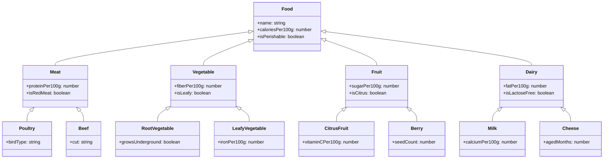

# hello-world
this is my hello world read me file!

## Hierarchical Class Diagram of Foods

```mermaid
classDiagram
    class Food {
      +name: string
      +caloriesPer100g: number
      +isPerishable: boolean
    }

    class Meat {
      +proteinPer100g: number
      +isRedMeat: boolean
    }

    class Vegetable {
      +fiberPer100g: number
      +isLeafy: boolean
    }

    class Fruit {
      +sugarPer100g: number
      +isCitrus: boolean
    }

    class Dairy {
      +fatPer100g: number
      +isLactoseFree: boolean
    }

    class Poultry {
      +birdType: string
    }

    class Beef {
      +cut: string
    }

    class RootVegetable {
      +growsUnderground: boolean
    }

    class LeafyVegetable {
      +ironPer100g: number
    }

    class CitrusFruit {
      +vitaminCPer100g: number
    }

    class Berry {
      +seedCount: number
    }

    class Milk {
      +calciumPer100g: number
    }

    class Cheese {
      +agedMonths: number
    }

    Food <|-- Meat
    Food <|-- Vegetable
    Food <|-- Fruit
    Food <|-- Dairy

    Meat <|-- Poultry
    Meat <|-- Beef

    Vegetable <|-- RootVegetable
    Vegetable <|-- LeafyVegetable

    Fruit <|-- CitrusFruit
    Fruit <|-- Berry

    Dairy <|-- Milk
    Dairy <|-- Cheese
```
